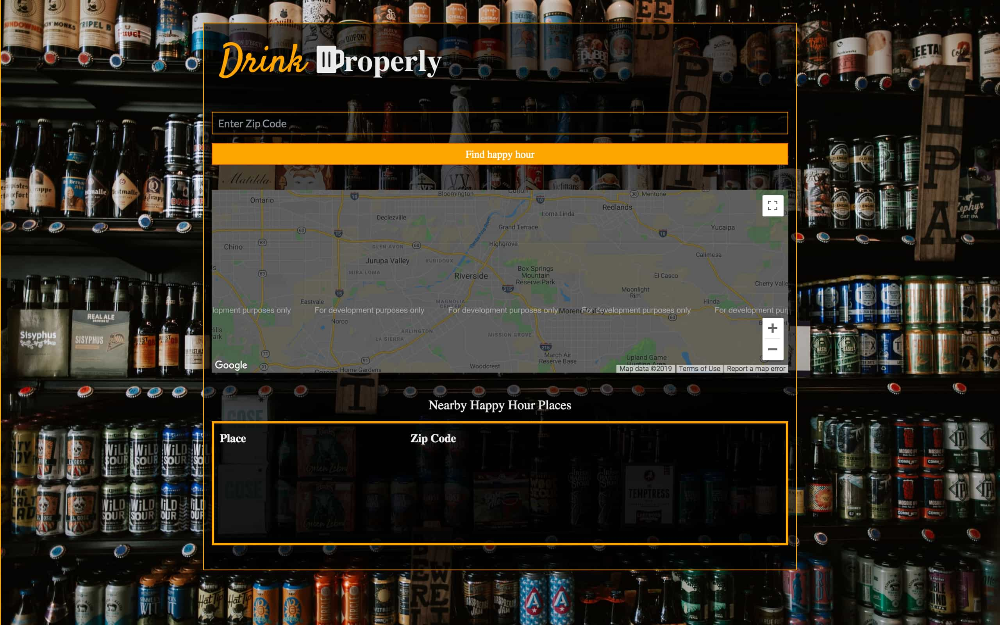

# :beer: Drink Properly

Our purpose for our application is to provide anyone who wants to find the best deals while still having a good time.

Drink Properly application locates restaurants and present their happy hour menus.

Our application's database only has Moreno Valley's zip code as of the momement: 92553.

<p align="center">

</p>


## 👨‍💻 **Getting Started**

To get started, make sure to clone the repo and fill the `.env` file with the appropriate information.

## ⟲ **Prerequisites**

- Clone repository

The minimum requirements to run this include:

- MySQL
- Npm


## 🌐 **Installing**

A step by step series of examples that tell you how to get a development env running.

1. Update your `.env` file with the required information. Make sure the mysql information is correct. 

.env example input
```
DB_PASSWORD=Ds~4lq~}.?*f~Ql$42J%aR7%SoKxaN
SECRET=SklZvh3a0PwQev901A1zT23vlG
```

2. Install required packages

```
npm install

```
## 📓 **Development**

Deployed on Heroku: https://guarded-fjord-58329.herokuapp.com/

## 🔨 **Built With**

* HTML
* CSS
* JavaScript
* MySQL
* Google Maps

## 🤝 **Contributing**

* **👤 Greg Rojas**
* **👤 Christian Arteaga**
* **👤 Victoria Jackson**

## 🗒 **License**

This project is licensed under the MIT License - see the [LICENSE.md](LICENSE.md) file for details.
